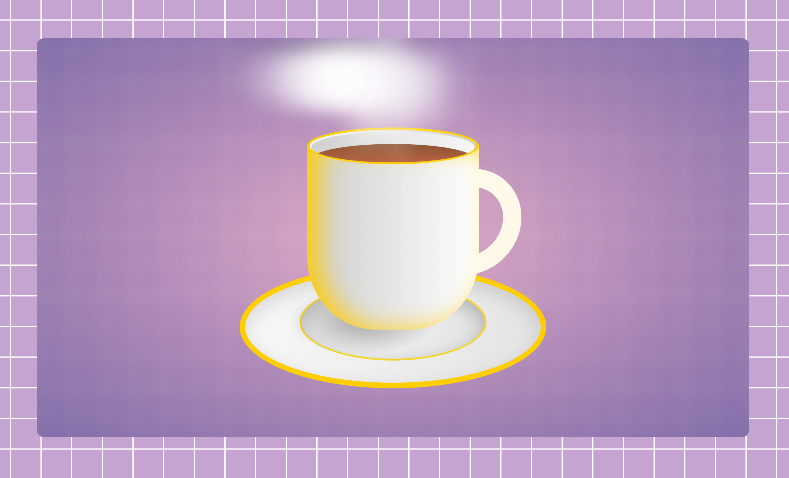

# Browser Animation

Artisitc piece of work to demonstrate what is possible with CSS and how it can be used to create even objects like a cup of coffee . The animation is created using only CSS and does not require any external libraries or frameworks. It is also compatible with all modern browsers, including Chrome, Firefox, Safari, and Edge.

## License

This project is licensed under the MIT License - see the [LICENSE](LICENSE) file for details.

## Visuals

## Contact

Created and maintained by tpreisig - feel free to reach out!
